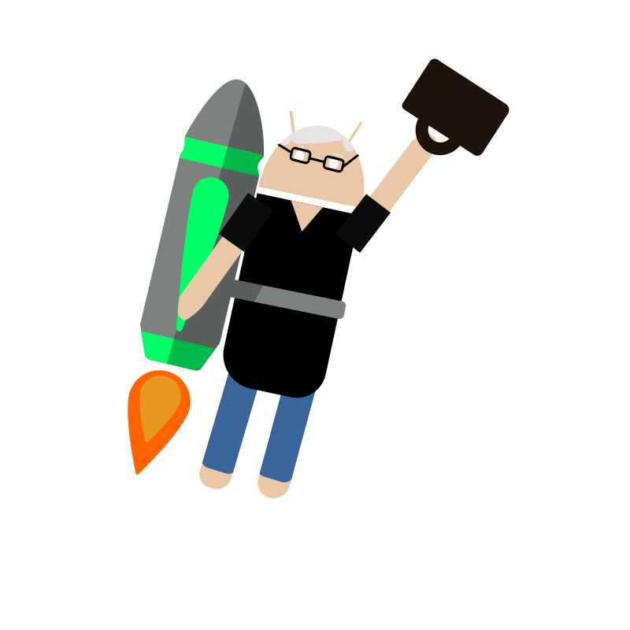

= Android Jetpack (pronounced Chet-pack) Logo

This is a silly project I started after Google I/O 2019. 
Chet Haase continues year after year to win the Android community over
and this year was no different. A friend of mine said something like
"Jetpack should have been called Chetpack". This inspired me to 
create this Android Chet-Pack icon. Hopefully we can get some 
patches or t-shirts for 2020 I/O. 

Chet, please let me know if you want me to remove this. Romain, I'll make
an Android Jetpack image for you too!

== License

"The Android robot is reproduced or modified from work created and shared by Google and used according to terms described in the Creative Commons 3.0 Attribution License."

https://creativecommons.org/licenses/by/3.0/
